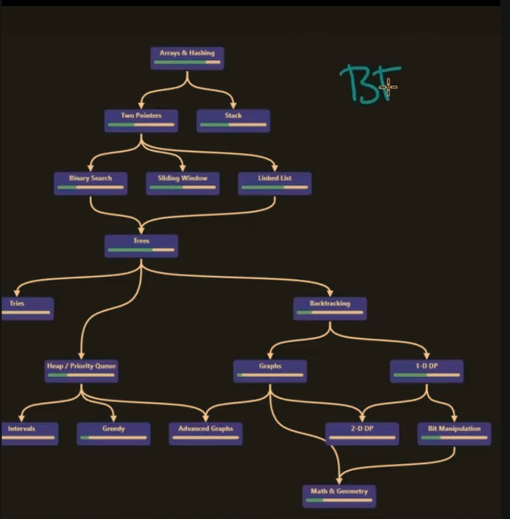

# DATA STRUCTURE AND ALGORITHM
## Roadmap to learn DSA
**Ngày 0**: Sử dụng ngôn ngữ lập trình như C hoặc C++. Bạn có thể học thêm về hướng đối tượng/ con trỏ và tìm hiểu về một số kỹ thuật lập trình.
**Ngày 1**: Hiểu khái niệm về độ phức tạp của thuật toán. Bây giờ hãy bỏ qua phần lý thuyết, nhưng với mỗi đoạn mã bạn viết, bạn sẽ có thể rút ra được độ phức tạp cả về thời gian và không gian.
**Ngày 2 - 10**: Hãy bắt đầu với một số cấu trúc dữ liệu đơn giản
Mảng
Danh sách liên kết
String
ngăn xếp
Hàng đợi
Hiểu các hoạt động cơ bản của chúng ( chèn, xóa, tìm kiếm, truyền tải ) và độ phức tạp của chúng - Bảng tính độ phức tạp của thuật toán Big-O và mã hóa tất cả chúng.
**Ngày 11 - 25**: Bây giờ chúng ta hãy tìm hiểu một số thuật toán đơn giản,
Sắp xếp - Insertion sort, Merge sort, Quick sort, Heap sort, Bucket sort, Counting sort, Radix sort, External sorting
Tìm kiếm - Tìm kiếm tuyến tính, Tìm kiếm nhị phân(cùng với các biến thể của nó).
Số nguyên tố - Sàng Eratosthenes, Kiểm tra tính nguyên tố
Chuỗi - Tìm kiếm chuỗi, LCS, phát hiện Palindrom
Các thuật toán khác - Euclide, Phép nhân ma trận, Số Fibonacci, Tam giác Pascal, Vấn đề mảng con tối đa
**Ngày 26 - 50**: Khi bạn đã cảm thấy thoải mái với mọi thứ ở trên, hãy thực hành thêm từ:
Cracking the Coding Interview
Elements of Programming Interviews
Programming Interviews Exposed: Secrets to Landing Your Next Job
GeekforGeeks
HackerRank
InterviewBit
Bám sát các chương về mảng, danh sách liên kết, chuỗi, ngăn xếp, hàng đợi và độ phức tạp.
**Ngày 51 - 60**: Cùng tìm hiểu một số cấu trúc dữ liệu phi tuyến tính,
Cây
Cây nhị phân, Cây tìm kiếm nhị phân - Duyệt cây, Tổ tiên chung thấp nhất, Độ sâu, Chiều cao và Đường kính, Tìm phần tử nhỏ thứ k
Heap
Bảng băm - Một số bài toán có thể tham khảo: Kiểm tra xem giải pháp sudoku có hợp lệ không
Đồ thị - Tìm kiếm theo chiều rộng, Tìm kiếm theo chiều sâu, , Topological sorting, Cây bao trùm tối thiểu, Bài toán đường đi ngắn nhất,
**Ngày 61-90**: Tham khảo các tài liệu trước và bắt đầu giải các bài toán về cây, bảng băm, heap và đồ thị.
**Ngày 91 - 100**: Hiểu lý thuyết độ phức tạp tính toán và tNP-completeness, Knapsack problem, Travelling salesman problem, SAT problem và một số bài toán khác.
**Ngày 101 -∞**: Bây giờ bạn đã giỏi hơn hầu hết các sinh viên CS. Tiếp tục rèn luyện các chủ đề trên và tìm các vấn đề khác để tìm hiểu!
